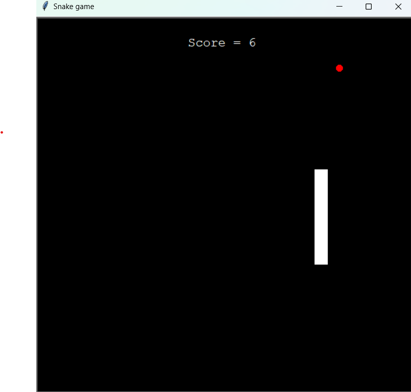
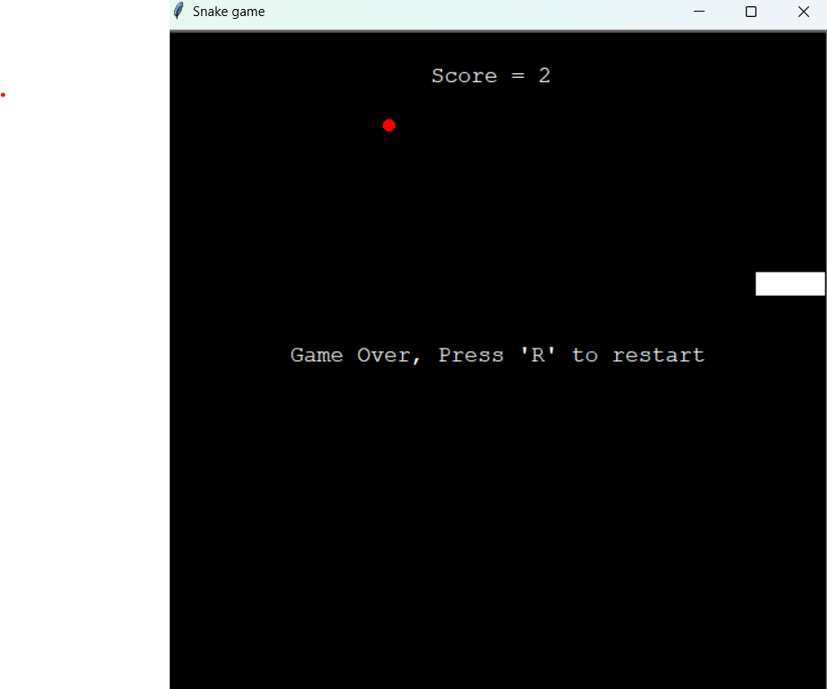

# Snake game using Python and the turtle module

### Like a regular snake game you gain points from eating the food and lose when you hit a wall or yourself

## How to play?
### Installation
• Clone the repo 
```
git clone https://github.com/ShayCohenn/Snake-game-python.git
```
• cd into the folder
```
cd Snake-game-python
```
• Run the main.py file
```
py main.py
```
### Usage
• Move with the arrow keys →↓↑←, 'r' to restard the game and 'Esc' to exit.<br>


